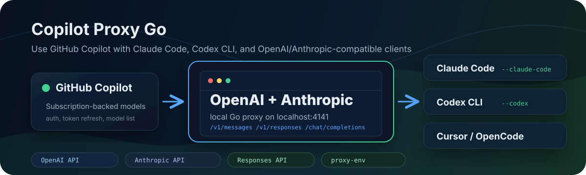
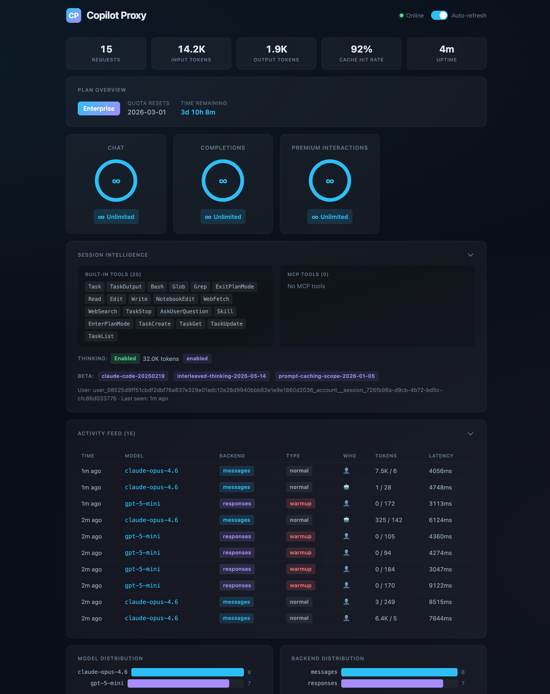

<div align="center">
  
[](https://ko-fi.com/R6R01Z1AEV)

</div>

# Copilot Proxy Go

[](https://github.com/tonghaoch/copilot-proxy-go/actions/workflows/go.yml)

Use **GitHub Copilot** with **Claude Code**, **Codex CLI**, Cursor, OpenCode, and any OpenAI/Anthropic-compatible client.

copilot-proxy-go is a local Go proxy that turns your GitHub Copilot subscription into OpenAI-compatible and Anthropic-compatible API endpoints, with first-class setup for Claude Code and Codex CLI.

## Works Great With

| Tool | One-command setup | API |
|------|-------------------|-----|
| Claude Code | `./copilot-proxy-go start --claude-code` | Anthropic Messages API |
| Codex CLI | `./copilot-proxy-go start --codex` | OpenAI Responses API |

## Highlights

- **Claude Code ready** — interactive model selection and environment generation with `--claude-code`
- **Codex CLI ready** — generates a Responses API configuration with `--codex`
- **VPN/proxy friendly** — use `--proxy-env` to route GitHub/Copilot requests through `http_proxy`, `https_proxy`, or `all_proxy`
- **OpenAI + Anthropic compatible** — supports Chat Completions, Responses, Messages, and Embeddings
- **Copilot-backed** — uses your GitHub Copilot account as the backend model provider
- **Token management** — GitHub OAuth device-code flow with automatic Copilot token refresh

## Quick Start

### 1. Build

```bash
go build -o copilot-proxy-go .
```

### 2. Authenticate

```bash
./copilot-proxy-go auth
```

This opens a GitHub device-code flow in your browser. The token is saved to `~/.local/share/copilot-proxy-go/github_token`.

### 3. Start for your client

Claude Code:

```bash
./copilot-proxy-go start --claude-code
```

Codex CLI:

```bash
./copilot-proxy-go start --codex
```

Generic OpenAI/Anthropic-compatible server:

```bash
./copilot-proxy-go start
```

The proxy runs on `http://localhost:4141`. OpenAI-compatible clients should use `http://localhost:4141/v1` as the base URL.

### Behind a VPN or proxy

If GitHub or Copilot requires a proxy in your network, export your proxy variables and start with `--proxy-env`:

```bash
export https_proxy=http://127.0.0.1:7890 \
  http_proxy=http://127.0.0.1:7890 \
  all_proxy=socks5://127.0.0.1:7890

./copilot-proxy-go start --proxy-env
```

## Features

- **Multi-API support** — Chat Completions, Messages (Anthropic), Responses, Embeddings
- **Automatic translation** — routes Anthropic requests to the best available backend (native Messages API → Responses API → Chat Completions)
- **Extended thinking** — full support for Claude thinking/reasoning blocks with interleaved thinking protocol
- **Streaming** — SSE streaming with proper event translation across all API formats
- **Quota optimization** — auto-routes compact/warmup requests to smaller models to save premium quota
- **Local dashboard** — view usage, request metrics, session state, and quota information in your browser

## Dashboard



## Usage with Claude Code

```bash
./copilot-proxy-go start --claude-code
```

This interactively selects models and generates the environment variables for Claude Code. Or set them manually:

```bash
export ANTHROPIC_BASE_URL=http://localhost:4141
export ANTHROPIC_AUTH_TOKEN=copilot-proxy
export ANTHROPIC_MODEL=claude-sonnet-4
export ANTHROPIC_SMALL_FAST_MODEL=gpt-5-mini
claude
```

## Usage with Codex CLI

```bash
./copilot-proxy-go start --codex
```

This interactively selects a Responses-capable model and generates a Codex command. Or set it manually:

```bash
export CODEX_API_KEY=copilot-proxy
export NO_PROXY=localhost,127.0.0.1,::1
export no_proxy=localhost,127.0.0.1,::1
codex \
  -c 'model="gpt-5.3-codex"' \
  -c 'model_provider="copilot-proxy"' \
  -c 'model_providers.copilot-proxy.name="Copilot Proxy"' \
  -c 'model_providers.copilot-proxy.base_url="http://127.0.0.1:4141/v1"' \
  -c 'model_providers.copilot-proxy.env_key="CODEX_API_KEY"' \
  -c 'model_providers.copilot-proxy.wire_api="responses"'
```

## API Endpoints

| Endpoint | Method | Description |
|----------|--------|-------------|
| `/v1/messages` | POST | Anthropic Messages API |
| `/v1/messages/count_tokens` | POST | Token counting |
| `/chat/completions` | POST | OpenAI Chat Completions |
| `/v1/chat/completions` | POST | OpenAI Chat Completions |
| `/responses` | POST | OpenAI Responses API |
| `/v1/responses` | POST | OpenAI Responses API |
| `/embeddings` | POST | Embeddings |
| `/models` | GET | List available models |
| `/v1/models` | GET | List available models |
| `/dashboard` | GET | Usage dashboard (web UI) |

## CLI Reference

### `start` — Run the proxy server

```
copilot-proxy-go start [flags]

Flags:
  -a, --account-type string   individual, business, or enterprise (default "individual")
  -c, --claude-code           interactive model selection for Claude Code
      --codex                 interactive model selection for Codex CLI
  -g, --github-token string   GitHub OAuth token (skips device code flow)
      --host string           host/IP to bind to, use 0.0.0.0 for all interfaces (default "127.0.0.1")
  -p, --port int              port to listen on (default 4141)
      --proxy-env             enable HTTP proxy from env vars (http_proxy/https_proxy/all_proxy)
      --show-token            print tokens to console
  -v, --verbose               enable verbose/debug logging
```

### `auth` — Authenticate with GitHub

```
copilot-proxy-go auth [flags]

Flags:
      --force        force re-authentication
      --show-token   print token to console
```

## License

MIT
